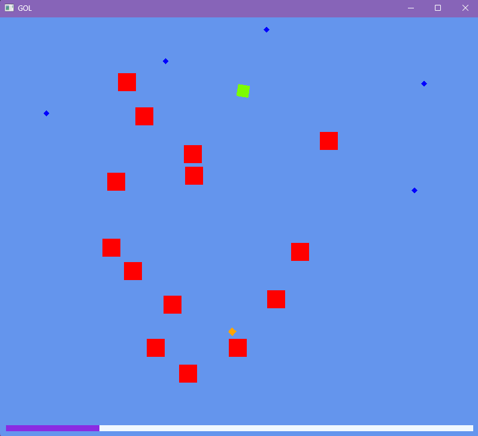

## Fax C# Pew (OpenTK Game)



This is a simple 2D shooter game built with C# and OpenTK. Control a player, shoot enemies, collect pickups, and gain experience to level up. The game demonstrates basic game architecture, entity management, event-driven logic, and OpenGL rendering using OpenTK.

### Features
- Player movement and shooting
- Enemies with simple AI
- Pickups and experience system
- Level progression
- Event bus for game events
- Custom 2D rendering

### Requirements
- .NET 9.0 SDK
- Windows (tested)
- Linux, macOS (untested)

### How to Run
1. Install .NET 9.0 SDK.
2. Run the game:
	```pwsh
	dotnet run
	```